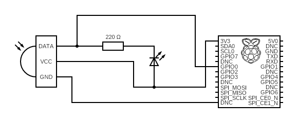
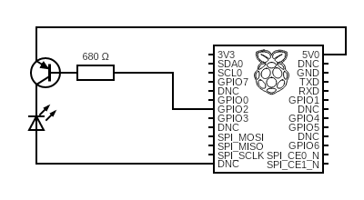

# piFan
This is a small project to play a bit with RaspberryPi, IR and my fan.

The aim is to be able to automate my fan. You know, where I live summer is really hot and it's nice to be able to automate when I want my fan on :).

## What we need
### Hardware
- RaspberryPi
- Jump wires
- 1 red LED
- 1 PN2222 transistor
- 1 680 ohm resistor
- 1 220 ohm resistor
- 1 IR receiver
- 1 IR LED
- Bread board

### Software

Install `python3-crontab`, `python3-pip` and the required modules.

```
sudo apt-get install python3-crontab
sudo apt-get install python3-pip
pip3 install -r requirements.txt
```
Create your SSL certificate
```
openssl genrsa -out key.pem 2048
openssl req -new -key key.pem -out csr.pem
openssl x509 -req -days 365 -in csr.pem -signkey key.pem -out cert.pem
```
### Environment variables

Create a `.env` file like:

```
location = <Folder-Location>
gpio_pin = <GPIO PIN>
ir_file = <JSON file with IR records>
cert = </certs/yourcert.pem>
key = </certs/yourkey.pem>
```

## The circuits

### IR Receiver

### IR Sender

## Recording IR signal
We will use [PiIR](https://github.com/ts1/PiIR) that is based on [PiGPIO](http://abyz.me.uk/rpi/pigpio/) a much better, easy to use and modern way to deal with IR from RPi than LIRC.

Record:
```
piir record --gpio <Your-GPIO-PIN> --file record.json
```
Once recorded we will use the `record.json` directly from the python web app.

## Web App
The web app is based on python flask. For scheduling the actions (turn on, turn off, set high speed for fan...) we use the native Linux Cron.

At the end, it's and extremely simple and easy to read app so you can modify if for whatever you want. It's just a demostration of how we can automate any IR-based system.

## Credits
- [Brian Schwind - Sending Infrared Commands From a Raspberry Pi Without LIRC](https://blog.bschwind.com/2016/05/29/sending-infrared-commands-from-a-raspberry-pi-without-lirc/)
- [PiIR](https://github.com/ts1/PiIR) 